The event loop we built contains several components inside it, and we will discuss them one by one.


## 1. PollHandle, the I/O Polling Abstraction

In this component, we use the [mio-rs](https://github.com/tokio-rs/mio) library as a cross-platform backend to deal with and manage event notifications. It uses OS interfaces such as `epoll` for Linux, `kqueue` for macOS, and `IOCP` for Windows.

> mio-rs: Mio is a fast, low-level I/O library for Rust focusing on non-blocking APIs and event notification for building high-performance I/O apps with as little overhead as possible over the OS abstractions.

```mermaid
graph TD
    A[PollHandle] --> B[mio::Poll]
    A --> C[Handler Registry]
    A --> D[Waker]

    B --> E[Platform Polling]
    C --> F[Token → Handler Mapping]
    D --> G[External Wake Events]
```



This component wraps `mio::Poll` with better handler management and maps each event to its handler to execute when it's ready. It basically sends a system call to the OS (such as `epoll` for Linux, as we said above) that means, "Hey Mr. OS! Wake me up when this I/O operation on this file is ready to be handled!" From it, you can let the OS notify you when a specific file/socket is available to read, write, or both.

You can register the events you want with their handlers, as in the following example:

```rust
let poller = PollHandle::new().unwrap();
let mut src = TestSource::new();

struct NoopHandler;
impl EventHandler for NoopHandler {
    fn handle_event(&self, _event: &mio::event::Event) {
        println!("Handling the Noop event...");
    }
}

poller
    .register(&mut src, mio::Token(1), mio::Interest::READABLE, NoopHandler)
    .expect("Failed to register src");
```

You can also deregister them and poll the events.

## 2. ThreadPool - Task Executor

After polling the events and the OS waking us up, we need to execute the handlers. The thread pool is similar to the `thread-per-connection` or `thread-per-task` model, but it limits the number of workers (threads) to reduce context-switching operations.


We can run a specific task as follows:

```rust
let pool = ThreadPool::new(4);
let counter = Arc::new(AtomicUsize::new(0));

for _ in 0..10 {
    let counter_clone = counter.clone();
    pool.exec(move || {
        counter_clone.fetch_add(1, Ordering::SeqCst);
    })
    .unwrap();
}
```

The pool will let an available worker finish this job in an individual thread by sending it through a message passing channel (we use a multi-producer, single-consumer channel because a standard multi-producer, multi-consumer channel isn't yet in the standard library and would require a third-party crate or an unstable feature). The thread will then execute this job.

## 3. Reactor - The Event Orchestration

It's a simple component that contains the thread pool and the poll handler to poll the events and dispatch them to the thread pool to execute their handlers. This design is what event loops are based on.


> The reactor software design pattern is an event handling strategy that can respond to many potential service requests concurrently. The pattern's key component is an event loop, running in a single thread or process, which demultiplexes incoming requests and dispatches them to the correct request handler.
> **Read more:** https://en.wikipedia.org/wiki/Reactor_pattern

## 4. EventLoop - The Public API

To work with the library, you don't need to deal with all the previous technical components. We provide a simple interface to use it by simply registering/deregistering events and running the event loop. It also allows you to shut it down.
It manages the lifecycle of the `Reactor`. It starts by polling for events and waiting for the OS to tell it when those events have occurred. When that happens, the handler will be executed.


