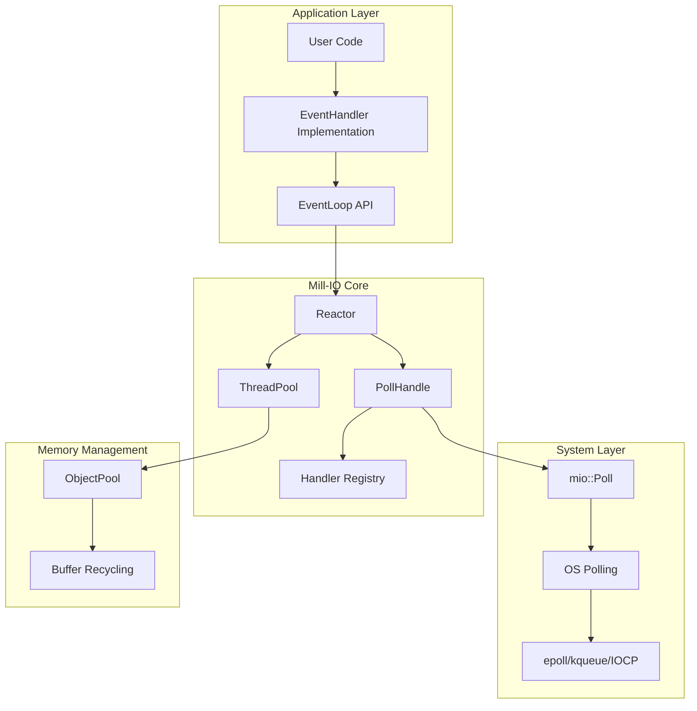
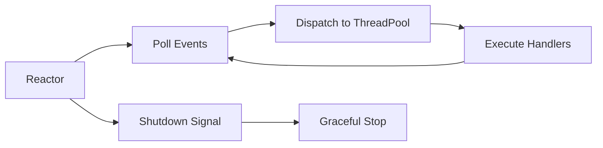
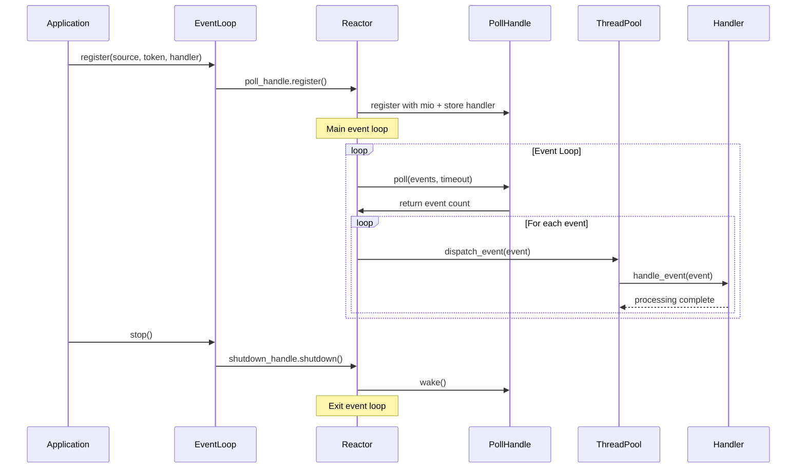

# Introduction

Have you ever wondered how large-scale systems work internally? It's a really important question. In engineering, there are a lot of techniques that are used to solve various problems. All of those have pros and cons; there is no **_perfect solution_**. Your job is to find the best solution for your case, one that has the pros that solve your problem and the fewest cons that you can bear. One of the critical problems is building a huge multi-user system. Throughout this article, we will discuss our problem and how we can solve it with our library, [mill-io](https://github.com/citadel-tech/Event-loop), an event-loop library I worked on during my Summer of Bitcoin internship to be used inside [Coinswap](https://github.com/citadel-tech/coinswap).

# Our Problem

Imagine we have a simple system, a web server. It's really simple; single-threaded and handles requests by reading/writing to the socket one by one. There's nothing special about it. If you have 1–10 users, maybe you wouldn't face any problems and you wouldn't need to implement any complex solution, but imagine those users become 1 million. Your website becomes a hell for your users due to single-threaded processing.

There's a simple solution for this problem: the `thread-per-connection` approach. Basically, we process each connection inside an individual thread concurrently to enhance performance and decrease the latency of each request. But still, we have performance issues. The OS manages thread execution with a scheduler. A thread has different states, and when it's blocked, the OS stores its context—such as CPU registers (general-purpose registers, stack pointer, and program counter), its stack, and scheduling information—inside the memory. Before it runs again, the CPU loads the thread's state from memory and stores the previous state in memory, as before. This operation is called **Context Switching**. Unfortunately, this operation takes time and have a high memory consumption per thread, and the more threads you have, the worse the performance. We have another struggle now!

# How to Solve This Problem?

To solve any problem, you'll have an initial solution. This solution solves your problem but not in the best way. We find the best solution by optimizing this basic solution. So let's optimize our solution!

The main problem we face is I/O-blocked operations, like reading/writing files. These operations take a lot of time due to the basic CPU operations, and the thread is blocked when it does these operations until it finishes.

You don't need to worry about that. The OS provides some syscalls that you can use to find the best solution. What we need is to know when files (or sockets in our web-server example) are ready for reading or writing. There are some system calls that notify us when a specific event occurs (like data being available to read) so we can run a piece of code. After that, we need to limit the number of threads to reduce the context-switching operations that appear in the `thread-per-connection` approach. Now, we can say we have a good solution!

# So, What's the Event Loop?

The event loop is a programming construct, not an OS primitive. It's a single-threaded loop that continuously checks for and processes incoming events and callbacks. Think of it as a supervisor for non-blocking operations.

Imagine the event loop as a receptionist at a busy office. The receptionist waits for guests (events) to arrive, then directs each guest to the right office (handler/callback) as soon as they're ready to be seen. This way, no guest is left waiting unnecessarily, and the receptionist never gets overwhelmed by trying to help everyone at once.

**Step-by-Step Breakdown:**
1. Wait for events (like incoming data or connections)
2. Detect which events are ready to be processed
3. Dispatch each event to its handler
4. Repeat the loop

This technique is mainly used to get the best performance using a single thread. It's primarily used by Node.js, and there are a lot of famous libraries to implement it, like [libevent](https://libevent.org/) and [libuv](https://libuv.org/). We can also add some enhancements by implementing it in a multi-threaded way, like what I did in [mill-io](https://github.com/citadel-tech/Event-loop).

Unlike the thread-per-connection model, the event loop handles many connections with just one (or a few) threads, reducing memory usage and context-switching overhead. It is especially efficient for I/O-bound tasks.

While traditional event loops are single-threaded, integrating a thread pool allows the system to process multiple events in parallel. The event loop can quickly detect and dispatch I/O events, while the thread pool executes event handlers or CPU-bound tasks concurrently. This approach improves scalability and responsiveness, especially under heavy load or when tasks require significant computation. In mill-io, the thread pool is configurable, so you can balance resource usage and performance for your specific use case.

**Minimal Pseudo-code Example:**
```rust
loop {
    let events = poll_for_events(); // Wait for I/O events
    for event in events {
        thread_pool.execute(|| handle_event(event)); // Dispatch to thread pool
    }
}
```


# Internals of Polling

Polling is a key technique for handling I/O efficiently in operating systems and networked programs. It started with the early UNIX `select` syscall, which let programs watch multiple files or sockets to see when they were ready for reading or writing. As systems grew, new APIs like `poll`, `epoll` (Linux), `kqueue` (BSD/macOS), and `IOCP` (Windows) were created to handle more connections and improve speed.

With polling, your program tells the OS what events it cares about (like when a socket is ready to read). The OS only wakes up your program when something actually happens, so you don't waste time constantly checking. This makes it possible for a single thread to manage thousands of connections without getting stuck waiting or using too much CPU.

# Other Solutions

Event loops aren't the only way to handle concurrency, especially for I/O-bound tasks. There are many approaches to solve our problem:

- **Multithreading**: Using multiple threads, where each thread handles a separate task. This is the traditional approach to concurrency, which we discussed before. It has some problems but is still a good solution.
- **Multiprocessing**: Using multiple processes, each with its own memory space, to handle different tasks. This is a robust solution that provides better isolation.
- **Asynchronous I/O with Callbacks**: This is the model the event loop uses, but without the central loop. Instead, each I/O request is made with a callback function that is invoked when the operation completes.
- **Asynchronous I/O with Coroutines/Generators**: This is a more modern approach that uses language features to make asynchronous code look like synchronous code, making it easier to read and write.


# How mill-io Works and Why It Exists?

This project was built during my [Summer of Bitcoin](https://www.summerofbitcoin.org/) internship (I will write an article about it soon) for the [Citadel-tech](https://github.com/citadel-tech) organization to be used inside the [Coinswap project](https://github.com/citadel-tech/coinswap) to enhance its performance through better I/O operation management without relying on heavyweight async runtimes such as [tokio-rs](https://tokio.rs/) and [async-std](https://github.com/async-rs/async-std). The implementation leverages **mio**'s polling capabilities to create a [reactor-based architecture](https://en.wikipedia.org/wiki/Reactor_pattern) with a configurable thread pool, ensuring **Coinswap**'s core logic remains runtime-agnostic while achieving optimal performance and resource utilization.

# Mill-IO Architecture 

Let's break down how mill-io works behind the scenes. The event loop is made up of a few simple building blocks that work together to handle lots of connections efficiently. Here's a quick overview:

- **Application Layer**: This is your code! You write event handlers and use the EventLoop API to register what you want to listen for.
- **Mill-IO Core**: The heart of the library. It includes the Reactor (the boss), PollHandle (the listener), ThreadPool (the workers), and a Handler Registry (keeps track of who does what).
- **System Layer**: This is where mill-io talks to the operating system using mio, which uses fast polling APIs like epoll, kqueue, or IOCP.
- **Memory Management**: Handles buffers and objects efficiently so things run smoothly.

Here's a visual to help you see how everything connects:



## 1. PollHandle – Listening for Events

PollHandle is like a receptionist who keeps an eye on all your sockets and files. It uses the mio library to ask the OS, "Let me know when something interesting happens!" When an event is ready, PollHandle knows which handler to call.

**Example:**
```rust
let poller = PollHandle::new().unwrap();
let mut src = TestSource::new();

struct NoopHandler;
impl EventHandler for NoopHandler {
    fn handle_event(&self, _event: &mio::event::Event) {
        println!("Handling the Noop event...");
    }
}

poller
    .register(&mut src, mio::Token(1), mio::Interest::READABLE, NoopHandler)
    .expect("Failed to register src");
```

## 2. ThreadPool – The Workers

Once an event is ready, we need someone to do the work. That's where the thread pool comes in. Instead of creating a new thread for every task (which is slow and uses lots of memory), we keep a small team of worker threads ready to go. When a job comes in, one of them grabs it and gets to work.

**Example:**
```rust
let pool = ThreadPool::new(4);
let counter = Arc::new(AtomicUsize::new(0));

for _ in 0..10 {
    let counter_clone = counter.clone();
    pool.exec(move || {
        counter_clone.fetch_add(1, Ordering::SeqCst);
    })
    .unwrap();
}
```

## 3. Reactor – The Boss

The Reactor is the coordinator. It listens for events using PollHandle and then tells the thread pool to run the right handler. It's like a dispatcher making sure every event gets handled quickly and efficiently.

**How it works:**
- Polls for events
- Dispatches them to the thread pool
- Makes sure everything keeps running smoothly



## 4. EventLoop – The Simple Interface

You don't need to worry about all the technical details. The EventLoop gives you an easy way to register events, start the loop, and shut things down when you're done. It manages the Reactor and keeps everything running in the background.

**How it feels to use:**
- Register your events and handlers
- Start the event loop
- Your handlers get called automatically when events happen
- Stop the loop when you're finished


If you want to understand the fully flow of the event-loop, you can talk a look on this diagram:




# Acknowledgments

This project was developed as part of the **Summer of Bitcoin 2025** program. Special thanks to:

- [Citadel-tech](https://github.com/citadel-tech) and the [Coinswap](https://github.com/citadel-tech/coinswap) project for providing the use case and requirements.
- **Summer of Bitcoin** organizers and mentors for their guidance.
- The **mio** project for providing the foundational polling abstractions.

# Helpful Resources

- [Mill-io](https://github.com/citadel-tech/Event-loop)
- [Event Loop Programming: A Different Way of Thinking](https://linuxjedi.co.uk/event-loop-programming-a-different-way-of-thinking)
- [Event Loop mechanism and how it works](https://raypvn.medium.com/event-loop-mechanism-and-how-it-works-b038279778c4)
- [JavaScript execution model - MDN - Mozilla](https://developer.mozilla.org/en-US/docs/Web/JavaScript/Reference/Execution_model)
