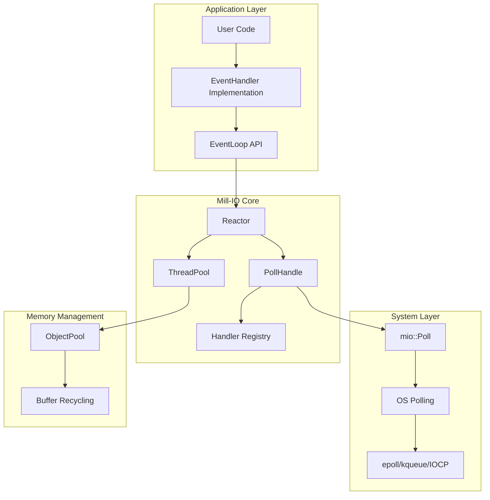
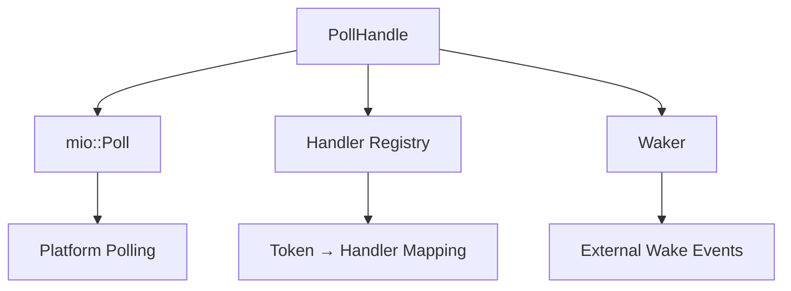
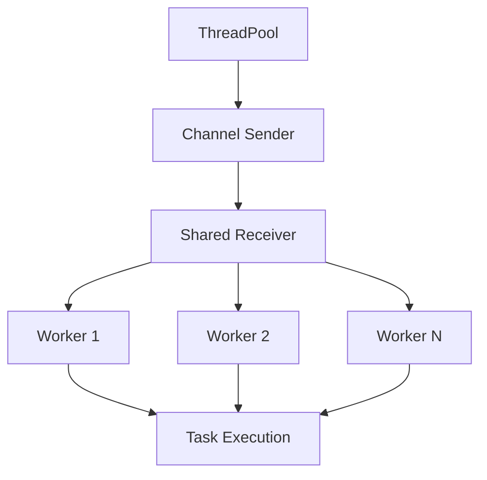
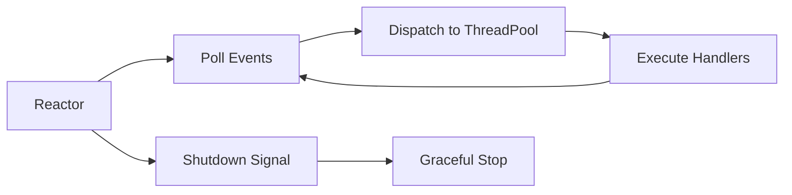
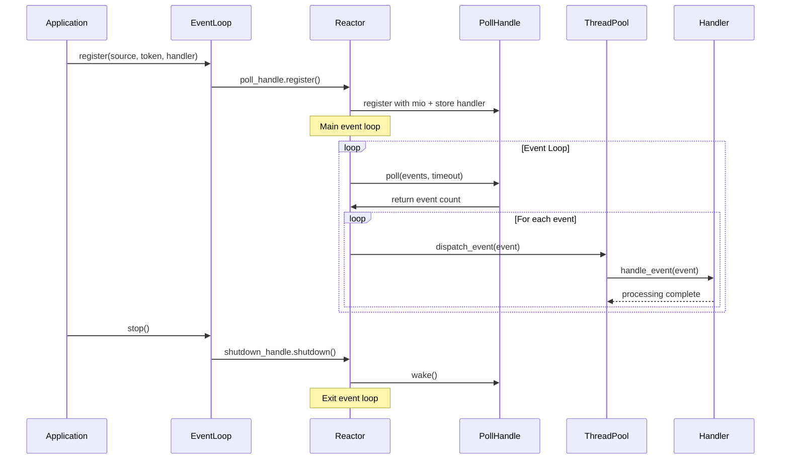

# Introduction

Have you ever wondered how large-scale systems work internally? It's a really important question. In engineering, there are a lot of techniques that are used to solve various problems. All of those have pros and cons; there is no **_perfect solution_**. Your job is to find the best solution for your case, one that has the pros that solve your problem and the fewest cons that you can bear. One of the critical problems is building a huge multi-user system. Throughout this article, we will discuss our problem and how we can solve it with our library, [mill-io](https://github.com/citadel-tech/Event-loop), an event-loop library I worked on during my Summer of Bitcoin internship to be used inside [Coinswap](https://github.com/citadel-tech/coinswap).

# Our Problem

Imagine we have a simple system, a web server. It's really simple; single-threaded and handles requests by reading/writing to the socket one by one. There's nothing special about it. If you have 1–10 users, maybe you wouldn't face any problems and you wouldn't need to implement any complex solution, but imagine those users become 1 million. Your website becomes a hell for your users due to single-threaded processing.

There's a simple solution for this problem: the `thread-per-connection` approach. Basically, we process each connection inside an individual thread concurrently to enhance performance and decrease the latency of each request. But still, we have performance issues. The OS manages thread execution with a scheduler. A thread has different states, and when it's blocked, the OS stores its context—such as CPU registers (general-purpose registers, stack pointer, and program counter), its stack, and scheduling information—inside the memory. Before it runs again, the CPU loads the thread's state from memory and stores the previous state in memory, as before. This operation is called **Context Switching**. Unfortunately, this operation takes time and have a high memory consumption per thread, and the more threads you have, the worse the performance. We have another struggle now!

# How to Solve This Problem?

To solve any problem, you'll have an initial solution. This solution solves your problem but not in the best way. We find the best solution by optimizing this basic solution. So let's optimize our solution!

The main problem we face is I/O-blocked operations, like reading/writing files. These operations take a lot of time due to the basic CPU operations, and the thread is blocked when it does these operations until it finishes.

You don't need to worry about that. The OS provides some syscalls that you can use to find the best solution. What we need is to know when files (or sockets in our web-server example) are ready for reading or writing. There are some system calls that notify us when a specific event occurs (like data being available to read) so we can run a piece of code. After that, we need to limit the number of threads to reduce the context-switching operations that appear in the `thread-per-connection` approach. Now, we can say we have a good solution!

# So, What's the Event Loop?

The event loop is a programming construct, not an OS primitive. It's a single-threaded loop that continuously checks for and processes incoming events and callbacks. Think of it as a supervisor for non-blocking operations.

This technique is mainly used to get the best performance using a single thread. It's primarily used by Node.js, and there are a lot of famous libraries to implement it, like [libevent](https://libevent.org/) and [libuv](https://libuv.org/). We can also add some enhancements by implementing it in a multi-threaded way, like what I did in [mill-io](https://github.com/citadel-tech/Event-loop).

# How `mill-io` Works and Why It Exists?

This project was built during my [Summer of Bitcoin](https://www.summerofbitcoin.org/) internship (I will write an article about it soon) for the [Citadel-tech](https://github.com/citadel-tech) organization to be used inside the [Coinswap project](https://github.com/citadel-tech/coinswap) to enhance its performance through better I/O operation management without relying on heavyweight async runtimes such as [tokio-rs](https://tokio.rs/) and [async-std](https://github.com/async-rs/async-std). The implementation leverages **mio**'s polling capabilities to create a [reactor-based architecture](https://en.wikipedia.org/wiki/Reactor_pattern) with a configurable thread pool, ensuring **Coinswap**'s core logic remains runtime-agnostic while achieving optimal performance and resource utilization.

# Architecture Details

The event loop we built contains several components inside it, and we will discuss them one by one.



## 1. PollHandle, the I/O Polling Abstraction

In this component, we use the [mio-rs](https://github.com/tokio-rs/mio) library as a cross-platform backend to deal with and manage event notifications. It uses OS interfaces such as `epoll` for Linux, `kqueue` for macOS, and `IOCP` for Windows.

> mio-rs: Mio is a fast, low-level I/O library for Rust focusing on non-blocking APIs and event notification for building high-performance I/O apps with as little overhead as possible over the OS abstractions.



This component wraps `mio::Poll` with better handler management and maps each event to its handler to execute when it's ready. It basically sends a system call to the OS (such as `epoll` for Linux, as we said above) that means, "Hey Mr. OS! Wake me up when this I/O operation on this file is ready to be handled!" From it, you can let the OS notify you when a specific file/socket is available to read, write, or both.

You can register the events you want with their handlers, as in the following example:

```rust
let poller = PollHandle::new().unwrap();
let mut src = TestSource::new();

struct NoopHandler;
impl EventHandler for NoopHandler {
    fn handle_event(&self, _event: &mio::event::Event) {
        println!("Handling the Noop event...");
    }
}

poller
    .register(&mut src, mio::Token(1), mio::Interest::READABLE, NoopHandler)
    .expect("Failed to register src");
```

You can also deregister them and poll the events.

## 2. ThreadPool - Task Executor

After polling the events and the OS waking us up, we need to execute the handlers. The thread pool is similar to the `thread-per-connection` or `thread-per-task` model, but it limits the number of workers (threads) to reduce context-switching operations.



We can run a specific task as follows:

```rust
let pool = ThreadPool::new(4);
let counter = Arc::new(AtomicUsize::new(0));

for _ in 0..10 {
    let counter_clone = counter.clone();
    pool.exec(move || {
        counter_clone.fetch_add(1, Ordering::SeqCst);
    })
    .unwrap();
}
```

The pool will let an available worker finish this job in an individual thread by sending it through a message passing channel (we use a multi-producer, single-consumer channel because a standard multi-producer, multi-consumer channel isn't yet in the standard library and would require a third-party crate or an unstable feature). The thread will then execute this job.

## 3. Reactor - The Event Orchestration

It's a simple component that contains the thread pool and the poll handler to poll the events and dispatch them to the thread pool to execute their handlers. This design is what event loops are based on.



> The reactor software design pattern is an event handling strategy that can respond to many potential service requests concurrently. The pattern's key component is an event loop, running in a single thread or process, which demultiplexes incoming requests and dispatches them to the correct request handler.
> **Read more:** https://en.wikipedia.org/wiki/Reactor_pattern

## 4. EventLoop - The Public API

To work with the library, you don't need to deal with all the previous technical components. We provide a simple interface to use it by simply registering/deregistering events and running the event loop. It also allows you to shut it down.
It manages the lifecycle of the `Reactor`. It starts by polling for events and waiting for the OS to tell it when those events have occurred. When that happens, the handler will be executed.



# Other Solutions

Event loops aren't the only way to handle concurrency, especially for I/O-bound tasks. There are many approaches to solve our problem:

- **Multithreading**: Using multiple threads, where each thread handles a separate task. This is the traditional approach to concurrency, which we discussed before. It has some problems but is still a good solution.
- **Multiprocessing**: Using multiple processes, each with its own memory space, to handle different tasks. This is a robust solution that provides better isolation.
- **Asynchronous I/O with Callbacks**: This is the model the event loop uses, but without the central loop. Instead, each I/O request is made with a callback function that is invoked when the operation completes.
- **Asynchronous I/O with Coroutines/Generators**: This is a more modern approach that uses language features to make asynchronous code look like synchronous code, making it easier to read and write.

# Acknowledgments

This project was developed as part of the **Summer of Bitcoin 2025** program. Special thanks to:

- **Citadel-tech** and the **Coinswap** project for providing the use case and requirements.
- **Summer of Bitcoin** organizers and mentors for their guidance.
- The **mio** project for providing the foundational polling abstractions.

# Helpful Resources

- [Mill-io](https://github.com/citadel-tech/Event-loop)
- [Event Loop Programming: A Different Way of Thinking](https://linuxjedi.co.uk/event-loop-programming-a-different-way-of-thinking)
- [Event Loop mechanism and how it works](https://raypvn.medium.com/event-loop-mechanism-and-how-it-works-b038279778c4)
- [JavaScript execution model - MDN - Mozilla](https://developer.mozilla.org/en-US/docs/Web/JavaScript/Reference/Execution_model)
